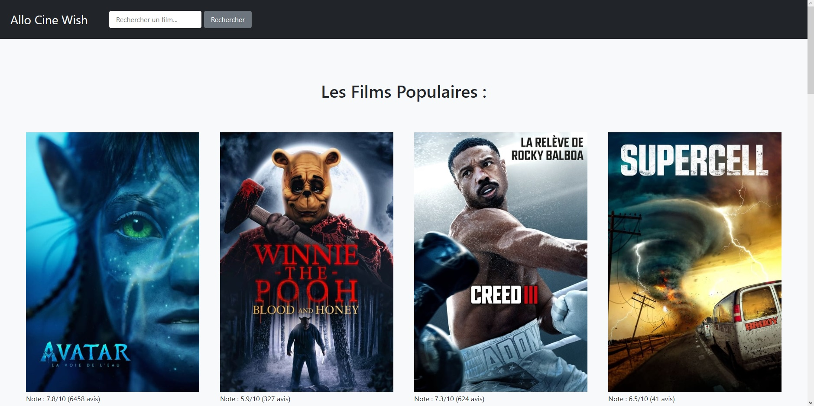
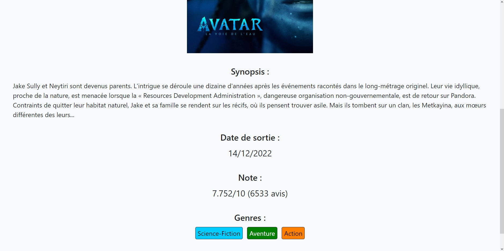
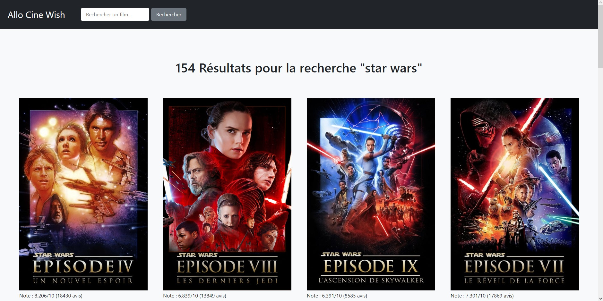

# Allo-Cine-Wish

A website that displays a gallery of the most popular movies at the moment and allows the user to view movie details. Works with "The Movie Database" API.
## Features
- Gallery of the most popular movies at the moment
- Movie details
- Search for a movie in the database
## Installation
1. Download the repository by clicking on `Code > Download ZIP`
2. Extract the ZIP file
3. Move the resulting files at the root of your website
4. Go into `my-config.php.example` and replace the placeholders by your informations
5. Then rename `my-config.php.example` to `my-config.php`
## Requirements
- PHP 7
## Usage
Once you have installed the project, you can open it by opening your website url in your browser.

You can navigate throught multiple pages of movies and see movies details.

Or search for a movie using the search entry in the header.

